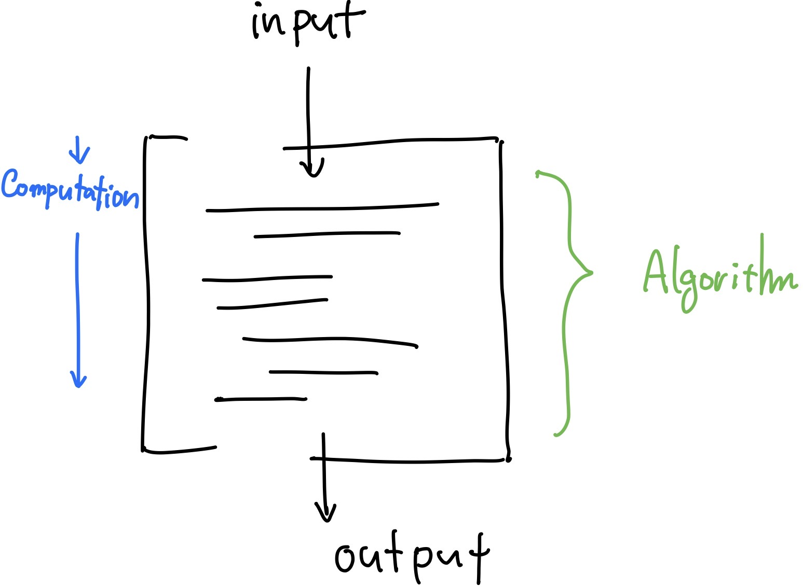
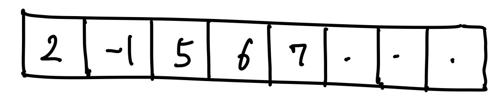
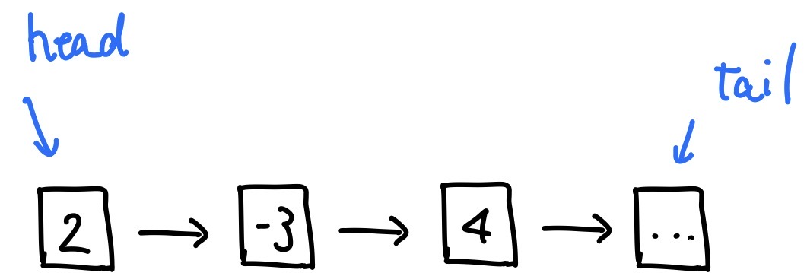
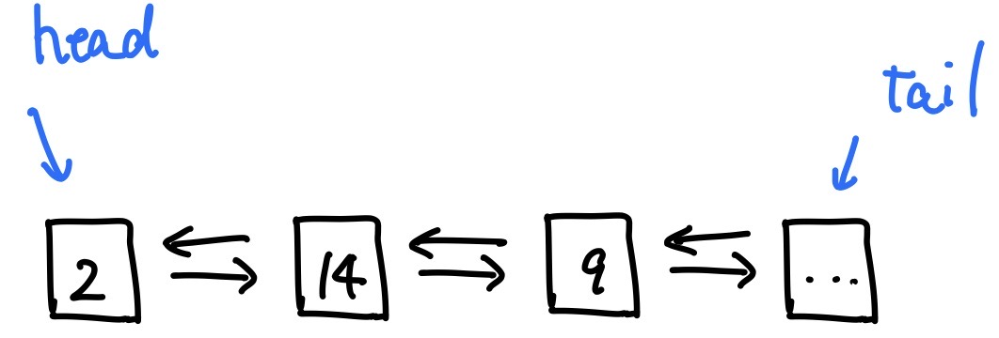
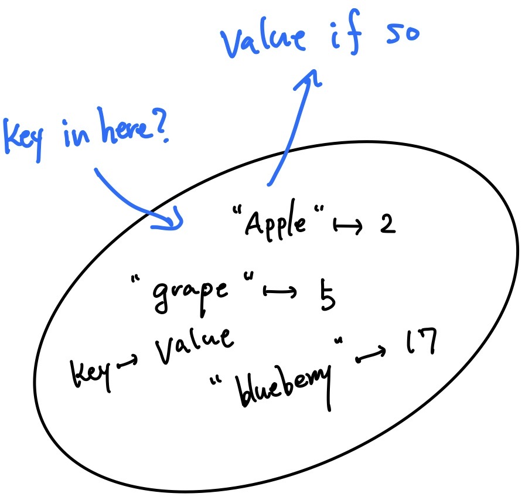
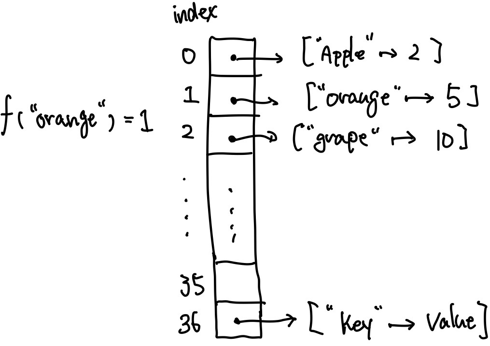

# Coding Practice Camp: Day1 :)

## Objectives

- Learn and practice problem solving and coding skills!
- Be able to apply those skills for your career or enjoy coding just for fun as hobby

## Style of This Camp

- **Lecture**
  1. We'll cover important concepts and techniques you'll need for pratices each day
  2. Get hands dirty and coding for traditional questions with helps
  3. you try a few questions related to topics taught in the day

- **Evaluation**
  - Weekly Assignments       (20%)
  - Coding Exams             (30%)
  - Mocking Coding Interview (50%)

## Resources

- **Website:** [Coding Practice Camp 2020](https://sourceshare2218.github.io) (stil under construction)
- **References:**
  - Introduction to Algorithms, thrid edition, Thomas H. Cormen, The MIT Press
  - The Art of Readable Code, Dustin Boswel, O'Reilly
  - Guide to Competitive Programming, Antti Laaksonen, Springer

## Table Of Contents

**Today's Goal: Overview and Introduction to Basic Concepts**

1. Quick Review of Programming Language
2. What is Algorithm?
3. Complexity
4. Basic Data Structures
5. A Coding Challenge

### 1 Quick Review of Programming Language

- [ ] Programming Language Paradigm
- [ ] Variables and Expressions
- [ ] Flow Controls
- [ ] Functions
- [ ] OOP (optional depending on programming language)

### 2 What is Algorithm

[Algorithm](https://en.wikipedia.org/wiki/Algorithm) is a sequence of instructions to solve a problem. An algorithm can take inputs and perform a computation, and then returns desired outputs.

There are well-established algorithms for simple problems like sorting and searching to complicated problems. An algorithm are desired to be robust, which means that it correctly works on any inputs (it would be useless if it works only in a restricted situation), and to be efficient.

### 3 Complexity

Simply put,  algorithm complexity is a measure for the efficiency of the algorithm. That gives you an insight on how long it takes for the algorithm to perform a computation and how much memory it needs to do the job.

#### 3.1 Asymptotic Analysis

In real world IT services, scales of computing can be huge and an algorithm might be repeatedly executed an astronomical amount of times. So, quite often we mostly care about the relation between computation time and input size. For exmpample, $f(n) = n^2$ might be as big as or even better than $g(n) = 1000n$ with relatively small n where each represents the time complexity of each algorithm. However, when n gets bigger and bigger, then $f(n)$ becomes much worse than $g(n)$.

The most commonly used notation is big-$O$, which is the worst case complexity. In other words, when an algorithm of $O(f(n))$ is executed, the worst computation time of the algorithm is proportional to $f(n)$. It could be less than $f(n)$ like 1 depending on inputs, but it will never be larger than $f(n)$.

#### 3.2 Algebra of Asymptotic Notations

n is input size and O is big-O notation

1. $O(\alpha n) = O(n)$ : where $\forall\alpha > 0(\alpha \in \R)$  
2. $O(f(n) + g(n)) = O(f(n))$ : where $\lim\limits_{n\to\infty}\frac{g(n)}{f(n)} = 0$
3. $O(1)$ : if the computation time is independent of input size
4. $O(n) + O(m) = O(n + m)$
5. $O(n) \times m = O(nm)$

So, roughtly speaking $Complexity \propto f(n)$ : where $O(f(n))$

### 4 Basic Data Structures

- **Array**: a sequence of data with fixed length. the size can't be dynamically modified. And all the data inside an array has to be the same type.  

arrays are stored contiguously in memory
- **Linked List**: a collection of data connected linearly with one another, which says that each element is connected only to next or previous element, and there aren't nodes that point to multiple nodes and nodes that are pointed by more than two nodes

those nodes can be linked to both sides, which is a doubly linked list.

- **Hash Table**: a container of data accessible by keys instead of indices. Hash table can take key and value strucure.
Conceptually, Hash table can be thought of as an unordered collection of data in which you can search a key with O(1) like below:

In its implimentation, it employs a hash function. The hash function translates a key into the corresponding index($f:key\to index$: like below) so that it doesn't have to check with all the elements. Thus the time complexity of searching is idially reduced to O(1). (However, that could be O(n) if there is a collisoin in worst case, but we can leave that out in usual contexts)

**So remember that you can search elements in hash table usually with O(1) whereas it takes O(n) to do it in arrays and linked lists.**

### 5 A Coding Challenge

[Go to Script Board!](https://sourceshare2218.github.io/PairsOfSameNumbers.html)
